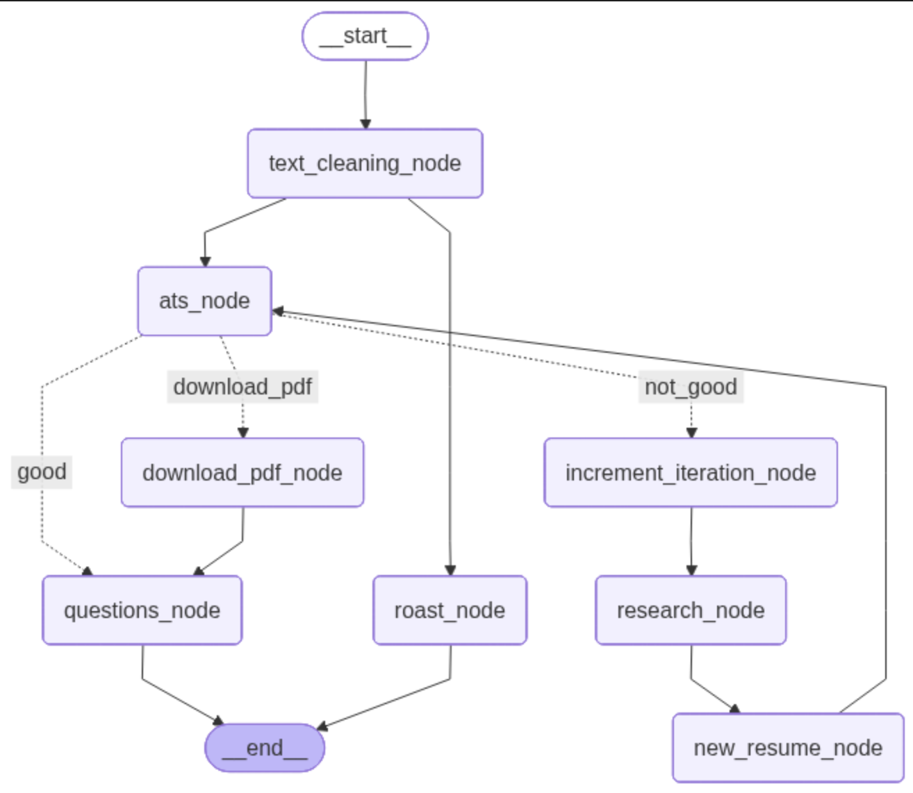

# ResumeForge MCP  
### Agentic AI Resume Optimizer using LangGraph + FastMCP

ResumeForge MCP is a production-style Agentic AI system built using **LangGraph + FastMCP** for autonomous resume optimization.

It performs:

- ATS score evaluation
- Roast Entertainment
- Weakness analysis
- Resume improvement suggestions
- Resume reconstruction
- Iterative ATS optimization loop
- PDF generation of improved resume
- Interview question generation

Instead of acting like a simple chatbot, ResumeForge works like an **autonomous AI recruiter assistant** that improves resumes until they become more competitive for 2026 hiring standards.

---

# Agentic System Architecture



---
# Problem Statement

Most resume tools are shallow.

They only:

- rewrite text
- give fake ATS scores
- provide generic suggestions

They do not think like a real recruiter.

ResumeForge solves this by using an iterative Agentic workflow that:

1. analyzes the resume brutally
2. identifies actual weak points
3. rebuilds the resume strategically
4. re-checks ATS score
5. repeats until the score improves
6. generates final recruiter-ready PDF

This creates a much stronger real-world system.

---

# Project Structure
```
ResumeForge/
│
├── main.py
├── test.py     # ignore, just for testing
│
├── graph/
│   ├── __init__.py
│   ├── state.py
│   ├── nodes.py
│   ├── router.py
│   └── workflow.py
│
├── tools/
│   ├── __init__.py
│   └── resume_tools.py
│
├── services/
│   ├── llm.py
│   └── pdf_generator.py
│
├── prompts/
│   ├── ats_prompt.py
│   ├── research_prompt.py
│   ├── resume_prompt.py
│   └── questions_prompt.py
│
├── requirements.txt
└── .env
```